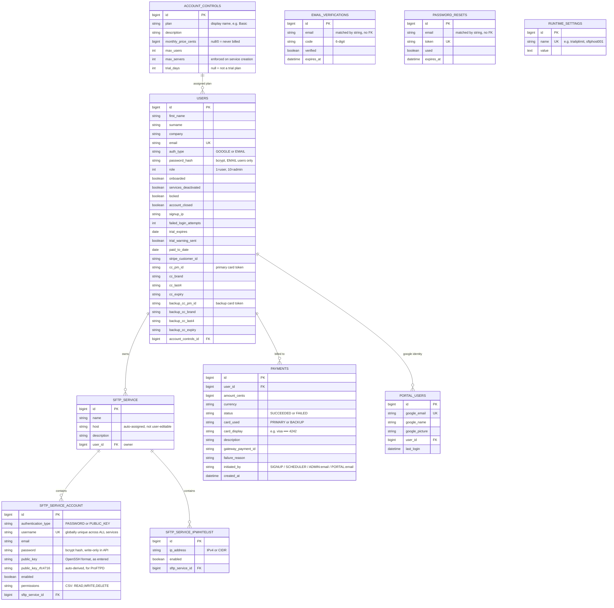

# Data Model

Entity-relationship diagram of every JPA entity in the app. Audit columns
(`creation_date`/`created_by`/`last_updated_date`/`last_updated_by`) are
carried by most tables but omitted from the boxes below for readability —
see the source model classes in `src/main/java/com/sftpmanager/model/` for
the exact list per entity.

## Notes

- **`EMAIL_VERIFICATIONS`** and **`PASSWORD_RESETS`** are intentionally
  **not** foreign-keyed to `USERS` — they're matched by the email address
  string. This is why they have no relationship line to `USERS` above; it's
  a deliberate simplification (verification/reset flows only need "does a
  code/token exist for this email", not a hard row link).
- **`RUNTIME_SETTINGS`** is a standalone key-value store with no
  relationships — used for `sftphost001` (SFTP host auto-assignment),
  `trialiplimit` (signup abuse cap), `welcomeemail`/`termsandconditions`
  (HTML email/T&C templates), among others.
- **Payment cards are never stored as raw numbers** — `USERS.cc_pm_id` /
  `backup_cc_pm_id` are opaque tokens from the payment gateway (Stripe, or
  the mock gateway in dev); `cc_brand`/`cc_last4`/`cc_expiry` are display-only
  metadata returned by the gateway.
- Three **Postgres views** (not JPA entities — created directly by
  `DataInitialiser` at startup) sit downstream of `SFTP_SERVICE_ACCOUNT`,
  `SFTP_SERVICE`, `USERS` and `SFTP_SERVICE_IPWHITELIST` for the ProFTPD SFTP
  host to query: `proftpd_users`, `proftpd_allowed_ips`, `proftpd_groups`.
  See [`process-sftp-provisioning.md`](process-sftp-provisioning.md) and
  `PROFTPD-SETUP.md`.
