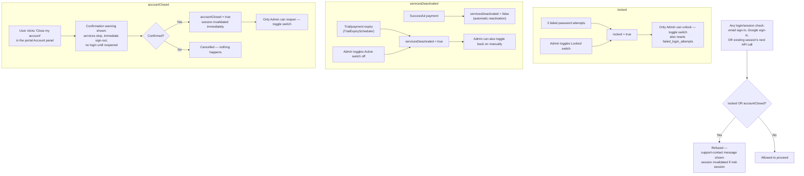

# 3.5 Account Lifecycle (lock / deactivate / close)

See `DOCUMENTATION.md` §3.5 for the element list. Three independent boolean
flags on `User`, each with its own trigger and its own reversal path.

**Key points**
- `locked` and `accountClosed` both **block login entirely**;
  `servicesDeactivated` only blocks *service access* — a deactivated user can
  still sign in to pay/reactivate.
- Every check happens at **three points**: email sign-in, the Google OAuth2
  success handler (redirects with a distinct error message per flag), and on
  every authenticated portal API call — so a flag flipped mid-session takes
  effect immediately, not just at next login.
- `accountClosed` also excludes the user from the nightly billing scheduler
  (see [process-billing-subscription.md](process-billing-subscription.md)).
