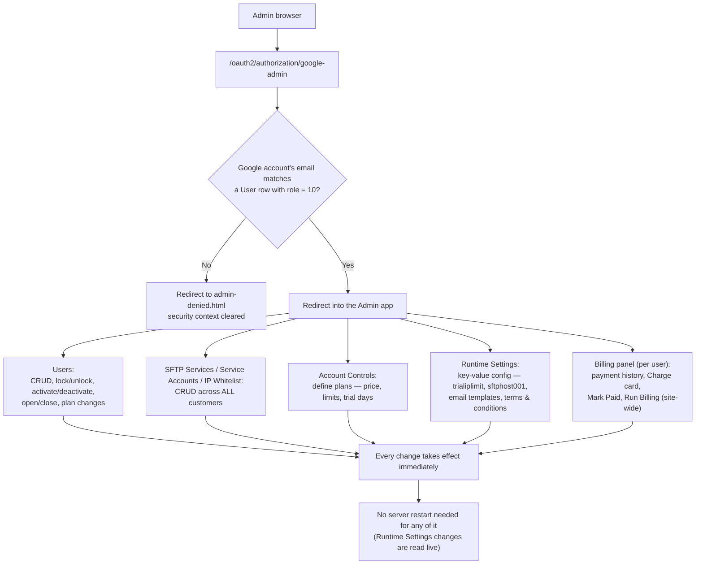

# 3.8 Admin Operations

See `DOCUMENTATION.md` §3.8 for the element list.

**Key points**
- Admin access is gated purely by `role = 10` on the `User` row — there's no
  separate admin-accounts table.
- Admin actions reuse the exact same services as the portal
  (`BillingService`, `SftpCredentialService`, etc.) rather than duplicating
  logic — e.g. an admin plan change runs through the identical proration
  code as a portal self-service upgrade (see
  [process-plan-changes.md](process-plan-changes.md)).
