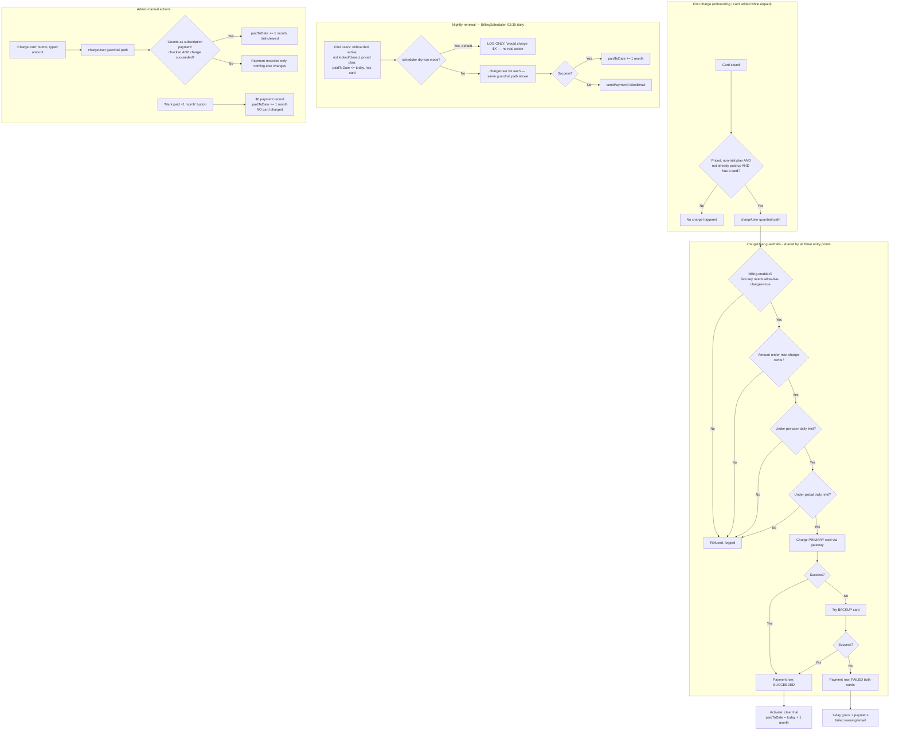

# 3.3 Billing & Subscription

See `DOCUMENTATION.md` §3.3 for the element list. Three independent
entry points feed the same `chargeUser()` guardrail path in `BillingService`.

**Key points**
- The guardrails (`billing.enabled`, `allow-live-charges`, per-charge cap,
  per-user/day cap, global/day cap) are the **only** gate between a live
  Stripe key and real money — `allow-live-charges` defaults to `false`
  specifically so switching to live keys can't accidentally start charging.
- The nightly scheduler defaults to **dry-run** — it only logs what it would
  do until deliberately switched off.
- Full test walkthrough (mock-mode test cards, Stripe test mode, go-live
  checklist) is in `BILLING-TESTING.md`.
