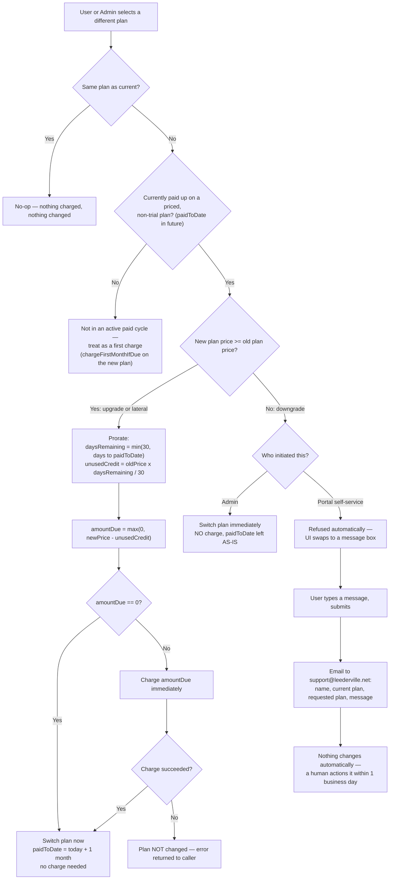

# 3.4 Plan Changes (upgrade / downgrade)

See `DOCUMENTATION.md` §3.4 for the element list. Same decision logic
(`BillingService.switchPaidPlan`) runs whether the change is initiated from
the portal's Change Plan modal or the admin's Account Controls dropdown.

**Key points**
- "Same plan" is blocked at both the UI (card greyed out, no click handler)
  and the server (`samePlan` short-circuit) — this closes the original bug
  report ("clicking Basic while already on Basic charges another $29").
- Proration uses a flat 30-day month for simplicity, capped so a user who
  has pre-paid several months ahead can't accumulate an oversized credit.
- Downgrades are the one case where **portal and admin genuinely diverge**:
  self-service downgrades always go to a human (fairness/anti-abuse); an
  admin's authority is trusted to apply one directly.
