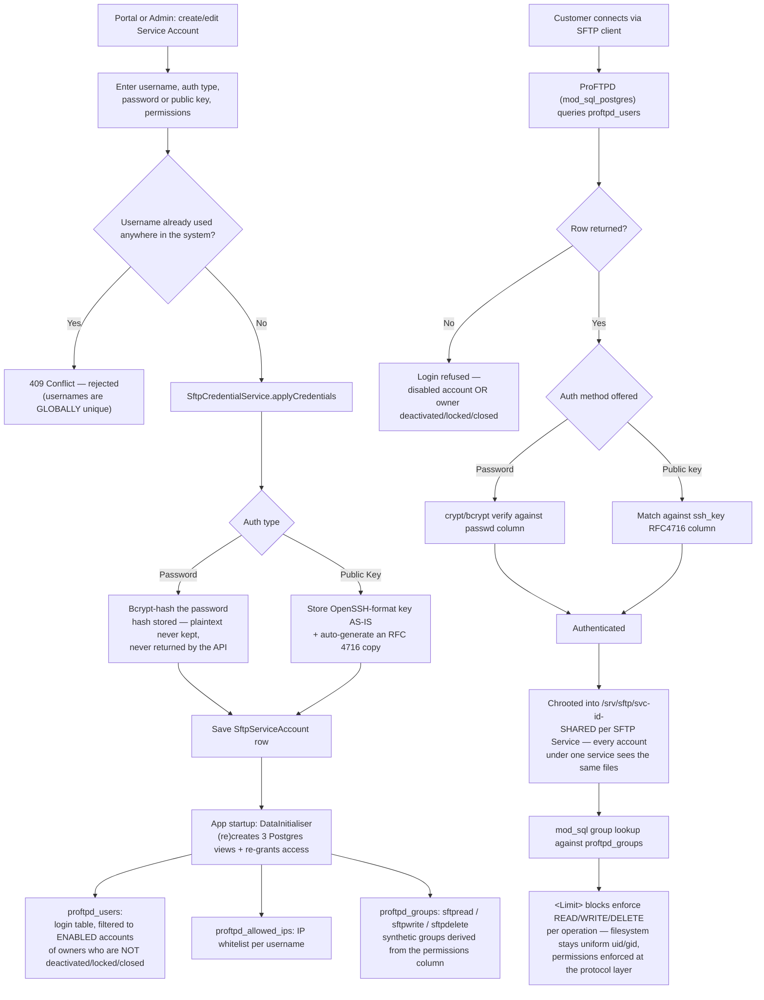

# 3.6 SFTP Provisioning (ProFTPD integration)

See `DOCUMENTATION.md` §3.6 and `PROFTPD-SETUP.md` for full server setup.

**Key points**
- Every admin kill-switch (lock, deactivate, close) applies to **real SFTP
  logins automatically** — no separate wiring, because `proftpd_users`
  filters on those same flags.
- Permissions are enforced by ProFTPD `<Limit>` blocks reading synthetic SQL
  groups, **not** by Linux file ownership — every account runs as the same
  uid/gid so files are freely shared within one service.
- View grants are **re-applied on every app restart** (the dev schema is
  rebuilt via `ddl-auto=create`, which would otherwise silently drop them —
  this was a real incident during setup; see `PROFTPD-SETUP.md`
  troubleshooting table).
