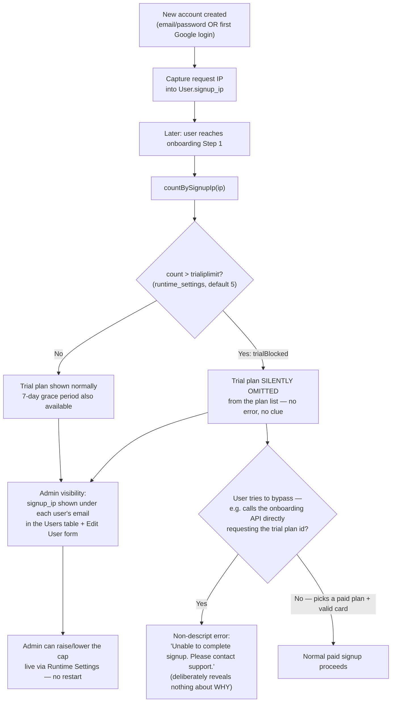

# 3.7 Signup Abuse Prevention

See `DOCUMENTATION.md` §3.7 for the element list.

**Key points**
- The block is on the **trial offer**, not on signup itself — nobody who
  intends to pay is ever turned away, which is why the cap (5) can be set
  tight without risking false positives on shared IPs (offices, mobile
  carrier NAT).
- The limit counts **all** accounts from an IP (paid or trial), so deleting
  stale test accounts frees up headroom for that IP.
- Known limitation: a determined abuser can rotate IPs (VPN); this raises
  the effort bar substantially rather than closing the door completely.
