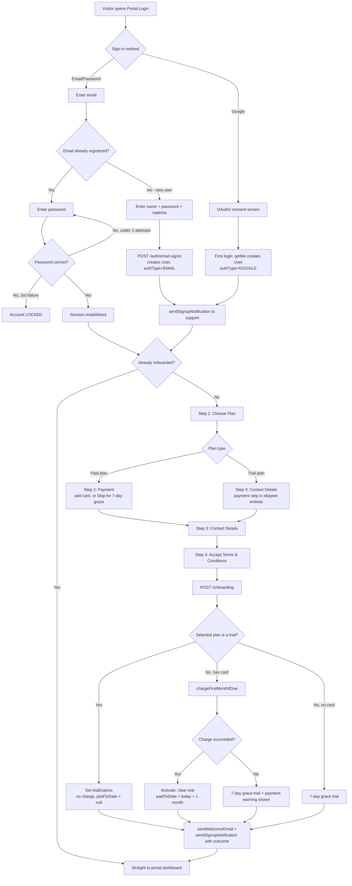

# 3.1 Sign-up & Onboarding

See `DOCUMENTATION.md` §3.1 for the element list (controllers/services involved).

**Key points**
- Support (`support@leederville.net`) gets notified twice per completed
  signup: once at account creation, once at onboarding completion (with the
  plan chosen and whether payment succeeded) — the gap between the two is
  itself useful signal (accounts created but never onboarded).
- A locked account (3 failed attempts) can only be unlocked by an admin —
  see [process-account-lifecycle.md](process-account-lifecycle.md).
- The "no card" and "card declined" paths converge on the same 7-day grace
  mechanism as a real trial plan — see
  [process-trial-management.md](process-trial-management.md).
