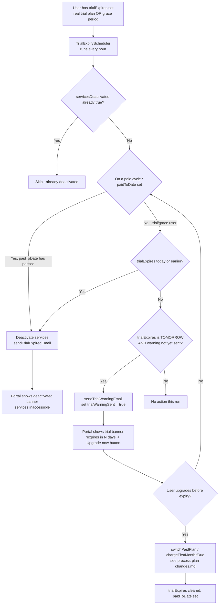

# 3.2 Trial Management

See `DOCUMENTATION.md` §3.2 for the element list.

**Key points**
- One scheduler, two distinct origins of `trialExpires`: a genuine free
  trial plan (`AccountControls.trialDays`), or a 7-day grace period granted
  when onboarding/upgrade happens with no card or a declined charge. The
  scheduler treats both identically.
- `trialWarningSent` prevents duplicate warning emails across the scheduler's
  hourly runs.
- The portal banner (shown on every page load while `trialExpires` is set)
  is the main visible surface of this process — see
  `DOCUMENTATION.md` §2.1 "Onboarding Wizard" / topbar banner.
